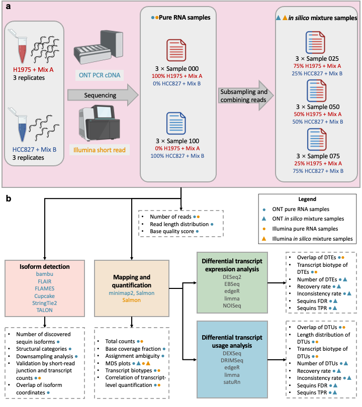

# Benchmarking long-read RNA-sequencing analysis tools using in *in silico* mixtures

This repository contains the code used to perform the analysis and generate the figures in this paper:

**Benchmarking long-read RNA-sequencing analysis tools using in silico mixtures**
Xueyi Dong, Mei R. M. Du, Quentin Gouil, Luyi Tian, Jafar S. Jabbari, Rory Bowden, Pedro L. Baldoni, Yunshun Chen, Gordon K. Smyth, Shanika L. Amarasinghe, Charity W. Law, Matthew E. Ritchie
Nature Methods 2023; doi: [https://doi.org/10.1038/s41592-023-02026-3](https://doi.org/10.1038/s41592-023-02026-3)

## Data Availability

Our RNA-seq data are available from Gene Expression Omnibus (GEO) under accession number [GSE172421](https://www.ncbi.nlm.nih.gov/geo/query/acc.cgi?acc=GSE172421) (main benchmarking dataset) and [GSE227000](https://www.ncbi.nlm.nih.gov/geo/query/acc.cgi?acc=GSE227000) (lab-based mixture of replicate 1). 

Please cite [our paper](https://doi.org/10.1038/s41592-023-02026-3) if you use our data and/or scripts in your studies.

### Sequin annotations

We've uploaded the sequin annotation files onto GitHub. Please see [XueyiDong/LongReadRNA/sequins/annotations](https://github.com/XueyiDong/LongReadRNA/tree/master/sequins/annotations).

## Index

### Pilot *in silico* mixture experiment

All scripts are available at [pilot](pilot) (Illumina) and [pilot_ONT/scripts](pilot_ONT/scripts) (ONT)

### Generate *in silico* mixture samples and preprocess

ONT: [ONT/mix_prepare](ONT/mix_prepare)

Illumina: [illumina/mix_prepare](illumina/mix_prepare)

### Generate downsampled samples and preprocess

Scripts are available at [downsample](downsample)

### Mapping and quantification

ONT: [ONT/preprocess](ONT/preprocess)

Illumina: [illumina/salmon_map.sh](illumina/salmon_map.sh)

### Quality control

ONT-specific: [ONT/QC](ONT/QC)

General: [longvsshort/overdisp.R](longvsshort/overdisp.R), [longvsshort/qc.R](longvsshort/qc.R) and [longvsshort/sequinCPMvsAbundance.R](longvsshort/sequinCPMvsAbundance.R)

### Isoform detection

Scripts to run softwares: [ONT/isoform_detection/methods](ONT/isoform_detection/methods)

Analysis of results: [ONT/isoform_detection/analysis](ONT/isoform_detection/analysis)

### Differential transcript expression

ONT: [ONT/DE_mix.Rmd](ONT/DE_mix.Rmd)

Illumina: [illumina/DE_mix.Rmd](illumina/DE_mix.Rmd)

Results comparison: [longvsshort/DEmixres.R](longvsshort/DEmixres.R)

### Differential transcript usage

ONT: [ONT/DTU_mix.Rmd](ONT/DTU_mix.Rmd)

Illumina: [illumina/DTU_mix.Rmd](illumina/DTU_mix.Rmd)

Results comparison: [longvsshort/DTUmixres.R](longvsshort/DTUmixres.R) and [longvsshort/DTUmixrestx.R](longvsshort/DTUmixrestx.R) 
